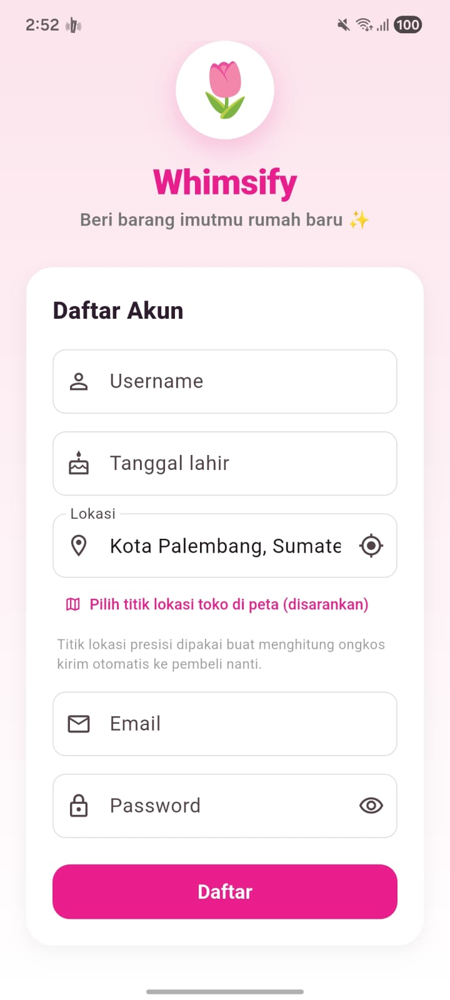
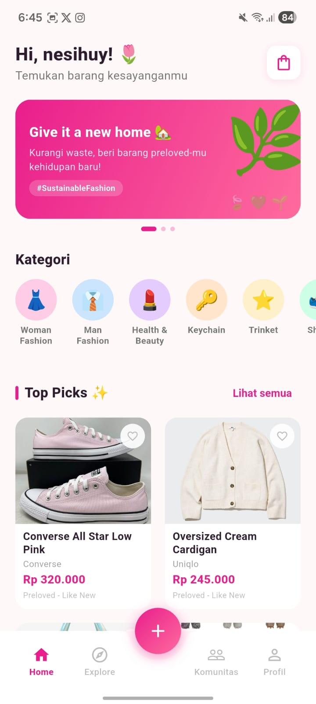
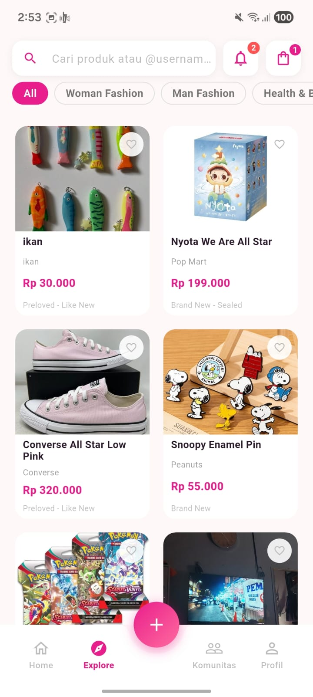
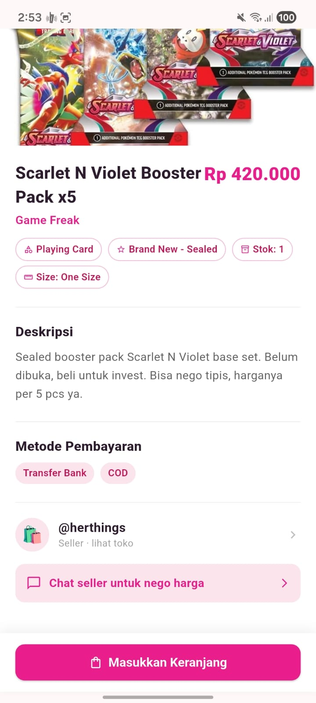
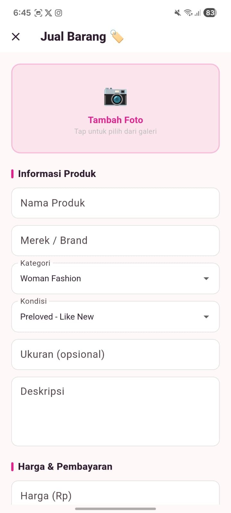
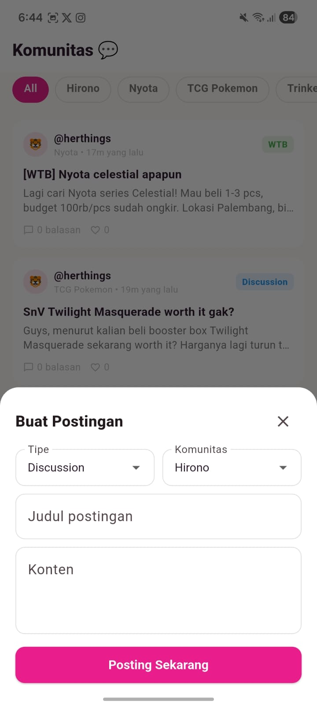
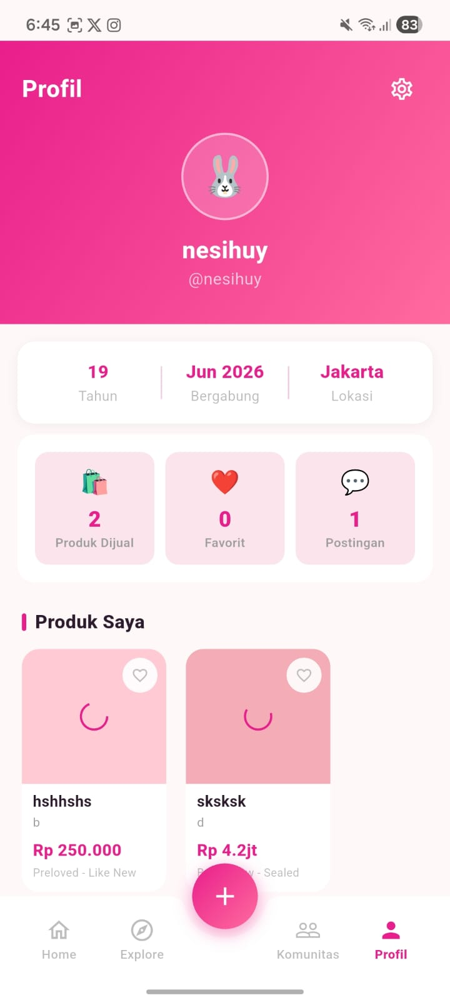
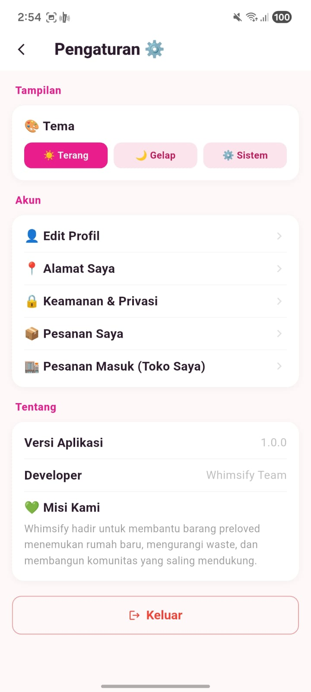

# Whimsify — Preloved Marketplace

> Give your cute items a new home.

Whimsify adalah aplikasi marketplace barang preloved dan komunitas kolektor. Aplikasi dibuat dengan Flutter, Supabase, dan Firebase Cloud Messaging.


## Fitur yang tersedia

- Daftar/masuk dengan email dan password, serta Google OAuth melalui Supabase Auth. Verifikasi email dan deep link `whimsify://auth-callback` juga ditangani aplikasi.
- Jelajahi, cari, filter, lihat detail, favoritkan, buat, edit, restock, dan hapus listing produk; unggah foto ke Supabase Storage.
- Keranjang, pembelian langsung, checkout, alamat pengiriman, pilihan pembayaran, daftar pesanan pembeli, dan pengelolaan pesanan seller sampai status selesai.
- Profil publik dan toko seller, avatar, produk yang dijual/dibeli, dan statistik profil.
- Komunitas: buat/jelajahi komunitas, follow, posting WTS/WTB/diskusi, balas, vote, laporkan, dan blokir pengguna. Relevansi topik memberi konfirmasi ringan; pemeriksaan toxicity memakai Google Cloud Natural Language bila API key tersedia.
- Chat antar pengguna dan penawaran harga.
- Notifikasi dalam aplikasi dan push untuk pesanan. Trigger database membuat baris notifikasi, Database Webhook memanggil Edge Function `send-push`, lalu function mengirim melalui Firebase Cloud Messaging.
- Tema terang/gelap/sistem dan penyimpanan preferensi lokal.

Fitur yang memakai layanan eksternal seperti Google login, peta, moderasi teks, dan push membutuhkan konfigurasi credential/provider seperti dijelaskan di bawah.

## Screenshot aplikasi

| Login | Beranda | Jelajahi | Detail produk |
|---|---|---|---|
|  |  |  |  |

| Jual | Komunitas | Profil | Pengaturan |
|---|---|---|---|
|  |  |  |  |

## Versi dan dependensi

- Aplikasi: `whimsify` versi `1.0.0+1` (version/build number dari `pubspec.yaml`).
- Dart SDK constraint: `>=3.3.0 <4.0.0`; gunakan Flutter stable yang menyertakan Dart dalam rentang tersebut.
- `pubspec.lock` mengunci versi transitive yang ter-resolve. Dependensi langsung dan constraint saat ini:

Sebagian SDK Firebase masih dideklarasikan sebagai dependency, tetapi jalur autentikasi dan CRUD aplikasi saat ini menggunakan Supabase. Firebase Core/Messaging dipakai untuk push notification.

| Paket | Constraint | Peran |
|---|---:|---|
| `provider` | `^6.1.1` | State management |
| `supabase_flutter` | `^2.6.0` | Auth, database, storage, Edge Functions |
| `firebase_core` | `^3.15.2` | Firebase initialization |
| `firebase_auth` | `^5.3.1` | SDK tersedia; login user aplikasi saat ini melalui Supabase Auth |
| `cloud_firestore` | `^5.4.4` | SDK dideklarasikan; data aplikasi saat ini disimpan di Supabase |
| `firebase_storage` | `^12.3.4` | SDK dideklarasikan; foto aplikasi saat ini memakai Supabase Storage |
| `firebase_messaging` | `^15.2.10` | FCM push token dan pesan |
| `flutter_local_notifications` | `^22.3.1` | Menampilkan push saat aplikasi foreground |
| `flutter_dotenv` | `^5.1.0` | Konfigurasi environment lokal |
| `flutter_secure_storage` | `^9.2.2` | Penyimpanan sesi aman |
| `shared_preferences` | `^2.3.2` | Preferensi lokal |
| `image_picker` | `^1.1.2` | Memilih foto produk/avatar |
| `geolocator` | `^14.0.2` | Lokasi perangkat |
| `geocoding` | `^5.0.0` | Konversi alamat/koordinat |
| `google_maps_flutter` | `^2.7.0` | Peta alamat |
| `google_mlkit_smart_reply` | `^0.13.0` | Smart Reply |
| `app_links` | `^6.3.0` | Deep link auth |
| `http` | `^1.2.1` | Google Cloud Natural Language API |
| `shimmer` | `^3.0.0` | Loading placeholder |
| `uuid` | `^4.4.0` | Pembuatan identifier |
| `flutter_test`, `integration_test` | Flutter SDK | Unit, widget, integration test |
| `flutter_lints` | `^3.0.0` | Aturan analisis Dart |

## Menjalankan aplikasi

### Prasyarat

- Flutter SDK stable dan Dart sesuai constraint di atas.
- Android Studio/emulator atau perangkat Android. Xcode diperlukan untuk build/run iOS di macOS.
- Project Supabase yang sudah memiliki schema, tabel, RLS policies, SQL functions, dan Storage buckets yang digunakan aplikasi.
- Konfigurasi Firebase untuk project/platform jika ingin menggunakan push notification.

### Clone, konfigurasi, dan run

```bash
git clone https://github.com/inezthing/Final-Project-Mobile-Development-GDGoC-Unsri.git
cd Final-Project-Mobile-Development-GDGoC-Unsri
flutter pub get
```

Buat `.env` di root project:

```env
SUPABASE_URL=https://<PROJECT_REF>.supabase.co
SUPABASE_ANON_KEY=<SUPABASE_ANON_KEY>
CLOUD_NL_API_KEY=<GOOGLE_CLOUD_NATURAL_LANGUAGE_API_KEY>
```

`CLOUD_NL_API_KEY` opsional. Jika tidak diisi atau API gagal, moderation request fail-open (konten diizinkan) sesuai implementasi saat ini. Jangan pernah memasukkan Supabase `service_role` key atau Firebase service-account private key ke `.env` aplikasi Flutter atau repository. Mobile app hanya memakai Supabase anon/publishable key; pembatasan data wajib dijaga dengan RLS.

Firebase native config harus cocok dengan package/bundle aplikasi:

- Android: `android/app/google-services.json`.
- iOS: `ios/Runner/GoogleService-Info.plist`.
- `lib/firebase_options.dart` dibuat/diperbarui oleh FlutterFire CLI (`flutterfire configure`).

Aktifkan Google provider di Supabase Auth, masukkan OAuth client ID/secret dari Google Cloud Console, lalu tambahkan `whimsify://auth-callback` ke Authentication → URL Configuration → Redirect URLs. Bundle ID/package ID, URL scheme, dan OAuth client harus cocok untuk platform target.

Jalankan di device/emulator aktif:

```bash
flutter devices
flutter run
```

Build Android APK:

```bash
flutter build apk --release
```

## Backend dan endpoint

Project Supabase yang saat ini terhubung di source menggunakan project ref `plmoyaxwjefvswtxpigq`. Endpointnya:

| Layanan | Endpoint |
|---|---|
| Supabase project | `https://plmoyaxwjefvswtxpigq.supabase.co` |
| Auth API | `https://plmoyaxwjefvswtxpigq.supabase.co/auth/v1` |
| REST API | `https://plmoyaxwjefvswtxpigq.supabase.co/rest/v1` |
| Storage API | `https://plmoyaxwjefvswtxpigq.supabase.co/storage/v1` |
| Push Edge Function | `https://plmoyaxwjefvswtxpigq.supabase.co/functions/v1/send-push` |
| Moderasi teks (opsional) | `https://language.googleapis.com/v2/documents:moderateText` |
| FCM HTTP v1 (server-to-server) | `https://fcm.googleapis.com/v1/projects/<FIREBASE_PROJECT_ID>/messages:send` |

Endpoint Google OAuth mengikuti konfigurasi provider Supabase dan tidak dipanggil langsung oleh aplikasi. Jangan menaruh credential rahasia di dokumentasi publik.

### Database dan Storage

Kode aplikasi mengakses tabel Supabase berikut (policy/schema harus cocok dengan operasi aplikasi): `profiles`, `addresses`, `products`, `product_purchase_stats`, `favorites`, `cart_items`, `orders`, `order_items`, `notifications`, `device_tokens`, `communities`, `community_follows`, `community_posts`, `community_replies`, `post_votes`, `blocked_users`, `conversations`, `messages`, `product_offers`, dan `reports`.

Storage buckets yang dipakai adalah `avatars` dan `product_images`. Checkout dan alur status pesanan memanggil PostgreSQL RPC `checkout_cart`, `place_order`, `mark_order_processing`, `mark_order_shipped`, dan `mark_order_completed`. Komunitas juga memanggil RPC `create_community` dan `report_content`. Terapkan schema/function dan RLS dari migrasi/setup backend project yang sesuai sebelum menjalankan operasi tersebut; jangan mengasumsikan membuat tabel saja sudah cukup.

### Push notification: webhook → Edge Function → FCM

1. Aplikasi mendaftarkan FCM token user ke tabel `device_tokens` setelah login.
2. Trigger database pada `order_items` membuat notifikasi `order_placed` untuk buyer dan `order_incoming` untuk seller. SQL trigger ini ada di `supabase/migrations/20260925000100_order_push_notifications.sql`.
3. Supabase Database Webhook untuk `public.notifications`, event `INSERT`, mengirim payload row baru dengan HTTP `POST` ke endpoint `send-push` di atas.
4. Edge Function membaca token berdasarkan `record.user_id` dan mengirim notification melalui FCM HTTP v1.

Deploy/update function dari root repository memakai Supabase CLI:

```bash
supabase login
supabase link --project-ref <PROJECT_REF>
supabase functions deploy send-push
```

Function membutuhkan secret `FIREBASE_SERVICE_ACCOUNT` berupa JSON service account Firebase dengan `client_email`, `project_id`, dan private key PEM PKCS#8 yang memiliki izin mengirim FCM. Masukkan secret melalui Supabase Dashboard → Edge Functions → Secrets (atau CLI secrets), jangan commit file JSON/private key. `SUPABASE_URL` dan `SUPABASE_SERVICE_ROLE_KEY` dipakai server-side oleh Supabase Edge Function untuk mencari device token; `service_role` tidak boleh masuk Flutter app/web client.

Di Supabase Dashboard, buat Database Webhook dengan pengaturan: schema `public`, table `notifications`, event `INSERT`, method `POST`, URL `https://<PROJECT_REF>.supabase.co/functions/v1/send-push`. Simpan Authorization/secret webhook sesuai opsi proteksi yang dikonfigurasi, lalu pastikan log Edge Function menerima request dan tabel `device_tokens` memiliki token aktif. Push foreground ditampilkan oleh `flutter_local_notifications`; tap notifikasi order diarahkan ke daftar pesanan buyer atau seller.

## Otomatisasi test dan hasil terakhir

Panduan langkah demi langkah ada di [TESTING.md](TESTING.md). Perintah utama:

```bash
flutter test test --reporter expanded
flutter analyze
flutter devices
flutter test integration_test/navigation_journey_test.dart -d <device-id>
```

Screenshot hasil run yang kamu kirim menunjukkan **unit/widget test lulus** dan **integration test `navigation_journey_test.dart` lulus**. Integration run juga membangun `app-debug.apk`. Unit/widget suite saat ini berisi 9 test yang mencakup parsing produk, harga checkout, relevansi topik, avatar, dan kartu produk. Skenario integration memeriksa alur navigasi profil dan pintasan pesanan.

| Unit dan widget test | Integration test |
|---|---|
|  |  |

Pembacaan hasilnya: `All tests passed!` berarti assertion pada test otomatis di run tersebut lulus. Integration test memakai Supabase client palsu untuk menguji UI/navigasi, jadi hasil ini **belum** membuktikan login Google, operasi CRUD ke Supabase online, webhook, ataupun push FCM sungguhan. Hasil terakhir `flutter analyze --no-pub` yang tercatat selesai dengan exit code 0 dan melaporkan 47 info/warning, termasuk API deprecated dan lint yang masih bisa dirapikan.

## Struktur repository

```text
lib/                 UI, model, state management, dan service Flutter
assets/branding/     Logo sumber untuk UI aplikasi
test/                Unit test dan widget test
integration_test/    Skenario uji alur navigasi aplikasi
supabase/functions/  Supabase Edge Functions
supabase/migrations/ SQL migration untuk backend
android/ ios/ web/   Platform app dan launcher assets
TESTING.md           Panduan menjalankan test
```

## Lisensi dan kontribusi

Repository ini adalah project pembelajaran Whimsify. Sebelum deploy publik, tinjau ulang RLS, konfigurasi OAuth, hak akses API key, secrets backend, serta kebijakan data dan layanan pihak ketiga.
