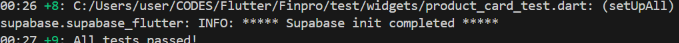
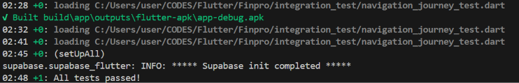

# Pengujian otomatis Whimsify

Proyek ini menyediakan unit test, widget test, dan integration test. Semua tes memakai data fixture dan Supabase URL palsu; tes tidak membuat/mengubah data di project Supabase atau mengirim push notification.

## Persiapan sekali saja

Di PowerShell, dari folder proyek:

```powershell
flutter pub get
```

## Jalankan semua unit dan widget test

```powershell
flutter test
```

Yang diperiksa:

- Parsing produk dari payload Supabase, termasuk seller, favorit, stok, dan jumlah pembelian.
- Harga checkout memakai harga nego yang diterima dan kuantitas yang tepat.
- Pemeriksaan relevansi topik komunitas untuk konten sesuai topik, di luar topik, dan komunitas tanpa kata kunci yang cukup.
- Avatar emoji dan fallback foto profil yang gagal dimuat.
- Kartu produk menampilkan nama/harga/badge dan merespons tap.

## Jalankan integration test

Siapkan Android Emulator atau perangkat Android dengan USB debugging, lalu jalankan:

```powershell
flutter test integration_test/navigation_journey_test.dart -d <device-id>
```

Untuk melihat ID perangkat:

```powershell
flutter devices
```

Integration test membuka `MainNavigation` dalam harness Flutter, lalu memeriksa tab Profil serta pintasan “Pesanan Saya” dan “Pesanan Masuk”. Harness memakai Supabase client beralamat palsu dan tidak memuat pesanan sungguhan; ini menguji integrasi widget/navigasi secara repeatable tanpa kredensial backend.

## Pemeriksaan sebelum deploy

Jalankan kedua kelompok berikut dan pastikan hasilnya sukses:

```powershell
flutter analyze
flutter test
flutter test integration_test/navigation_journey_test.dart -d <device-id>
```

Jalankan integration test pada perangkat yang sama dengan target rilis (Android/iOS) sebelum deploy. Tes otomatis ini tidak menggantikan pemeriksaan manual OAuth Google, FCM push, webhook Supabase, atau transaksi order terhadap project staging. Untuk menguji transaksi CRUD end-to-end, gunakan project staging terpisah beserta akun dan data uji—jangan arahkan skenario destruktif ke database production.

## Hasil test terakhir yang tersedia

- **Unit dan widget:** screenshot run yang diberikan menunjukkan `All tests passed!`. Suite berisi 9 test yang mencakup parsing produk, kalkulasi harga checkout, relevansi topik komunitas, avatar fallback, dan interaksi kartu produk.
- **Integration:** screenshot run `integration_test/navigation_journey_test.dart` juga menunjukkan `All tests passed!`; Flutter berhasil membangun `build/app/outputs/flutter-apk/app-debug.apk` untuk menjalankan skenario tersebut.
- **Static analysis:** `flutter analyze --no-pub` selesai dengan exit code 0. Masih ada 47 info/warning, terutama API Flutter deprecated dan lint yang perlu dirapikan.

### Screenshot hasil test

**Unit dan widget test:**



**Integration navigation test:**



Integration test menguji alur UI/navigasi dengan Supabase client palsu. Bukti ini tidak mencakup verifikasi OAuth Google, CRUD terhadap database online, konfigurasi webhook, atau push FCM nyata. Jalankan ulang ketiga pemeriksaan di atas setelah perubahan kode dan sebelum release.
